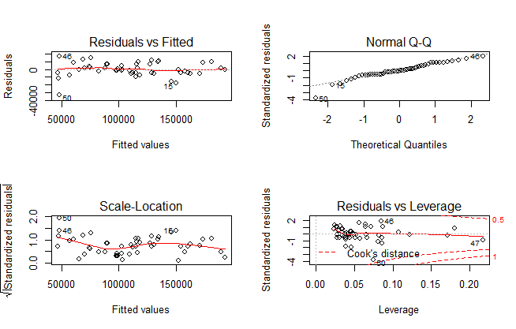

# Multi-Linear-Regression
* Data source : https://raw.githubusercontent.com/tuyenhavan/Statistics/Dataset/50-Startups.csv
* Working Environment : RStudio 1.2.5001
* The dataset contains 50 observations of 5 variables : Spending on R&D, Administration, Marketing, the State (New York, California, Florida) in which the Startup is based and the Profit generated by the Startup.

# Objective : Attempt a prediction of a startup's profitability based on its spending and the State.

# Exploratory Data Analysis
```
#Importing the data
>startup_data <- read.csv("50-startups.csv")

#Visualizing the data
> str(startup_data)
'data.frame':	50 obs. of  5 variables:
 $ R.D.Spend      : num  165349 162598 153442 144372 142107 ...
 $ Administration : num  136898 151378 101146 118672 91392 ...
 $ Marketing.Spend: num  471784 443899 407935 383200 366168 ...
 $ State          : Factor w/ 3 levels "California","Florida",..: 3 1 2 3 2 3 1 2 3 1 ...
 $ Profit         : num  192262 191792 191050 182902 166188 ...

#Given the relative small size of the dataset, cross-validation will not be performed.

#Evaluation of correlation matrix between numerical variables
> startup_subset <- startup_data %>% select(R.D.Spend, Administration, Marketing.Spend, Profit)

> cor(startup_subset)
                R.D.Spend Administration Marketing.Spend    Profit
R.D.Spend       1.0000000     0.24195525      0.72424813 0.9729005
Administration  0.2419552     1.00000000     -0.03215388 0.2007166
Marketing.Spend 0.7242481    -0.03215388      1.00000000 0.7477657
Profit          0.9729005     0.20071657      0.74776572 1.0000000

#The above matrix suggests Profit is strongly and positively correlated with Marketing and R&D spending.
#Administration spending however shows low correlation with other variables and as such is not likely to affect Profit. To be confirmed.

#Analysis of variance between Profit(quantitative) and State(qualitative) (Single factor)
>startup_factor <- startup_data %>% select(State, Profit)
>test_aov <- aov(Profit~State, data=startup_factor)
>summary(test_aov)
            Df    Sum Sq   Mean Sq F value Pr(>F)
State        2 1.901e+09 9.503e+08   0.575  0.567 
Residuals   47 7.770e+10 1.653e+09 

#The p-value (=0.567) of aov test reveals "If there is no influence of State on Profit, this is likely to happen 56.7% of the time.
```
# Model Fitting
```
#Model fitting with all explanatory variables
>my_model = lm(Profit~., data=startup_data)
>summary(my_model)
Call:
lm(formula = Profit ~ ., data = startup_data)

Residuals:
   Min     1Q Median     3Q    Max 
-33504  -4736     90   6672  17338 

Coefficients:
                  Estimate Std. Error t value Pr(>|t|)    
(Intercept)      5.013e+04  6.885e+03   7.281 4.44e-09 ***
R.D.Spend        8.060e-01  4.641e-02  17.369  < 2e-16 ***
Administration  -2.700e-02  5.223e-02  -0.517    0.608    
Marketing.Spend  2.698e-02  1.714e-02   1.574    0.123    
StateFlorida     1.988e+02  3.371e+03   0.059    0.953    
StateNew York   -4.189e+01  3.256e+03  -0.013    0.990    
---
Signif. codes:  0 ‘***’ 0.001 ‘**’ 0.01 ‘*’ 0.05 ‘.’ 0.1 ‘ ’ 1

Residual standard error: 9439 on 44 degrees of freedom
Multiple R-squared:  0.9508,	Adjusted R-squared:  0.9452 
F-statistic: 169.9 on 5 and 44 DF,  p-value: < 2.2e-16

#The above summary shows :
#1-Considering a multiple linear model is a good idea since the Adjusted R-squared and Multiple R-squared are close to 1.
#2-The p-values associated with factors StateFlorida & StateNew York are high >95% (the reference for the T test is California). This is in accordance with the AOV test performed earlier.
#2-Therefore we accept the null hypothesis : There is no difference between the influence of Florida compared to California,the influence of New York compared to California & furthermore no influence of the State in which the Startup is located on its profitability.
#3-The low p-value (<2e-16) of the T test on R.D.Spend suggests this variable has an influence on the Profit (null hypothesis rejected).
#4-Administration and Marketing.Spend have high p-values (12% & 60%) which suggest these variables have no influence on Profit. To be confirmed in variable selection procedure.
```
# Variable Selection
```
#State has no influence on Profit -> Removed from model
#Considering only numerical explanatory variables in the model
>my_model = lm(Profit~., data=startup_numeric)
>summary(my_model)
Call:
lm(formula = Profit ~ ., data = startup_numeric)

Residuals:
   Min     1Q Median     3Q    Max 
-33534  -4795     63   6606  17275 

Coefficients:
                  Estimate Std. Error t value Pr(>|t|)    
(Intercept)      5.012e+04  6.572e+03   7.626 1.06e-09 ***
R.D.Spend        8.057e-01  4.515e-02  17.846  < 2e-16 ***
Administration  -2.682e-02  5.103e-02  -0.526    0.602    
Marketing.Spend  2.723e-02  1.645e-02   1.655    0.105    
---
Signif. codes:  0 ‘***’ 0.001 ‘**’ 0.01 ‘*’ 0.05 ‘.’ 0.1 ‘ ’ 1

Residual standard error: 9232 on 46 degrees of freedom
Multiple R-squared:  0.9507,	Adjusted R-squared:  0.9475 
F-statistic:   296 on 3 and 46 DF,  p-value: < 2.2e-16

#1-Proceeding with a backward variable selection procedure, the variable Administration is excluded (highest p-value) => It has no influence on Profit.
#1-The value of the Adjusted R-squared is 0.9475.

#Considering only Marketing.Spend & R.D.Spend in the model
>my_model = lm(Profit~R.D.Spend+Marketing.Spend, data=startup_numeric)
>summary(my_model)
Call:
lm(formula = Profit ~ R.D.Spend + Marketing.Spend, data = startup_numeric)

Residuals:
   Min     1Q Median     3Q    Max 
-33645  -4632   -414   6484  17097 

Coefficients:
                 Estimate Std. Error t value Pr(>|t|)    
(Intercept)     4.698e+04  2.690e+03  17.464   <2e-16 ***
R.D.Spend       7.966e-01  4.135e-02  19.266   <2e-16 ***
Marketing.Spend 2.991e-02  1.552e-02   1.927     0.06 .  
---
Signif. codes:  0 ‘***’ 0.001 ‘**’ 0.01 ‘*’ 0.05 ‘.’ 0.1 ‘ ’ 1

Residual standard error: 9161 on 47 degrees of freedom
Multiple R-squared:  0.9505,	Adjusted R-squared:  0.9483 
F-statistic: 450.8 on 2 and 47 DF,  p-value: < 2.2e-16

#1-The value of the Adjusted R-squared improves to 0.9483.
#2-The global Fisher test shows low (good) p-value <2.2e-16 => Good model.
#2-The p-value associated with Marketing.Spend is 6%. This variable can be rejected or accepted depending on the acceptable p-value threshold.
#3-If the threshold is 7%, the p-value = 6% is judged acceptable and the conclusion is : Profit depends on both R.D.Spend and Marketing.Spend.
#4-Furthermore removing Marketing.Spend variable gives a smaller Adjusted R-squared value of 0.9454 (as compared to 0.9483)  i.e >my_model = lm(Profit~R.D.Spend, data=startup_numeric)
```
# Verifying Assumptions on Residuals/Noise
```
>par(mfrow=c(2,2))
>plot(my_model)
```



# Pedicting Profitability (Out-of-sample)


# Conclusion
 
 